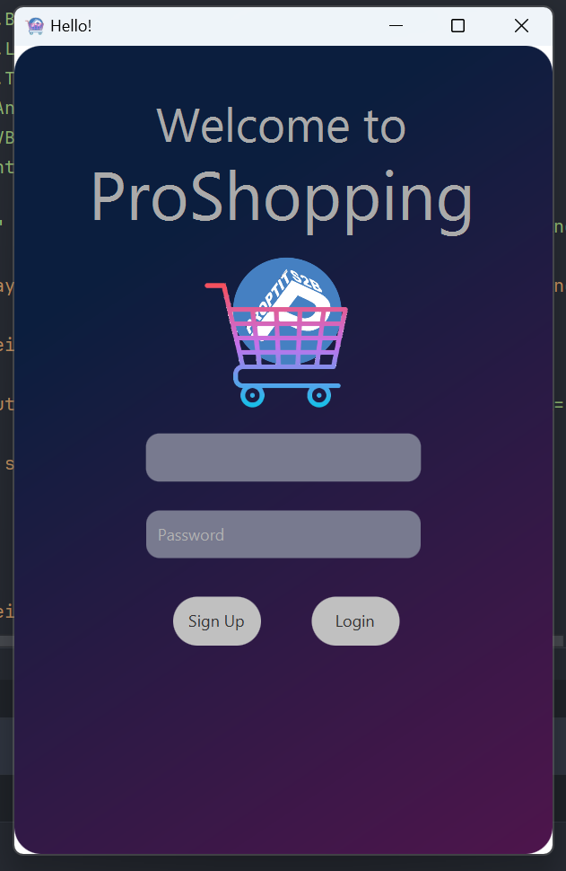
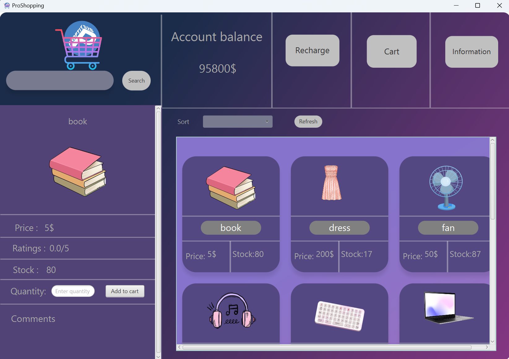
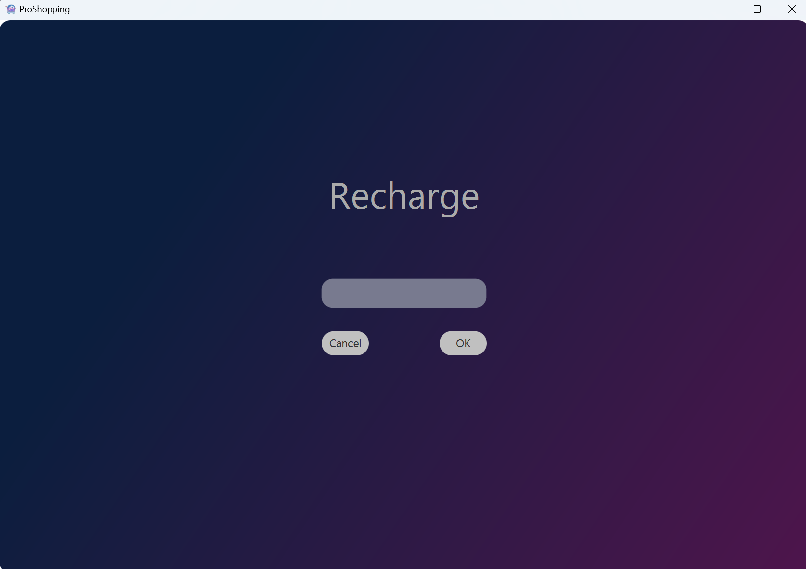
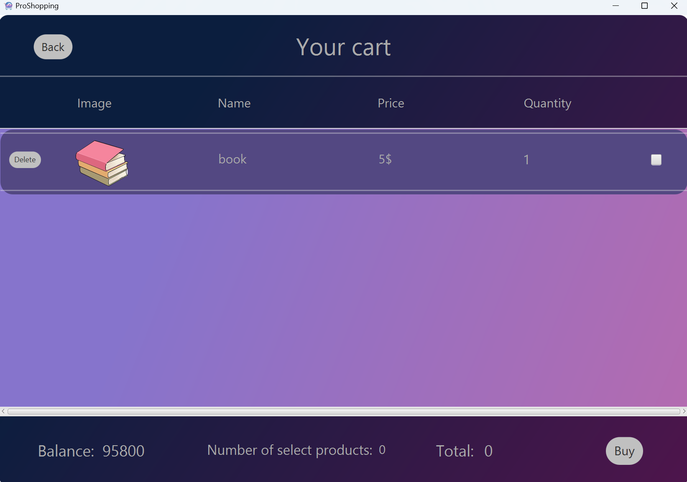
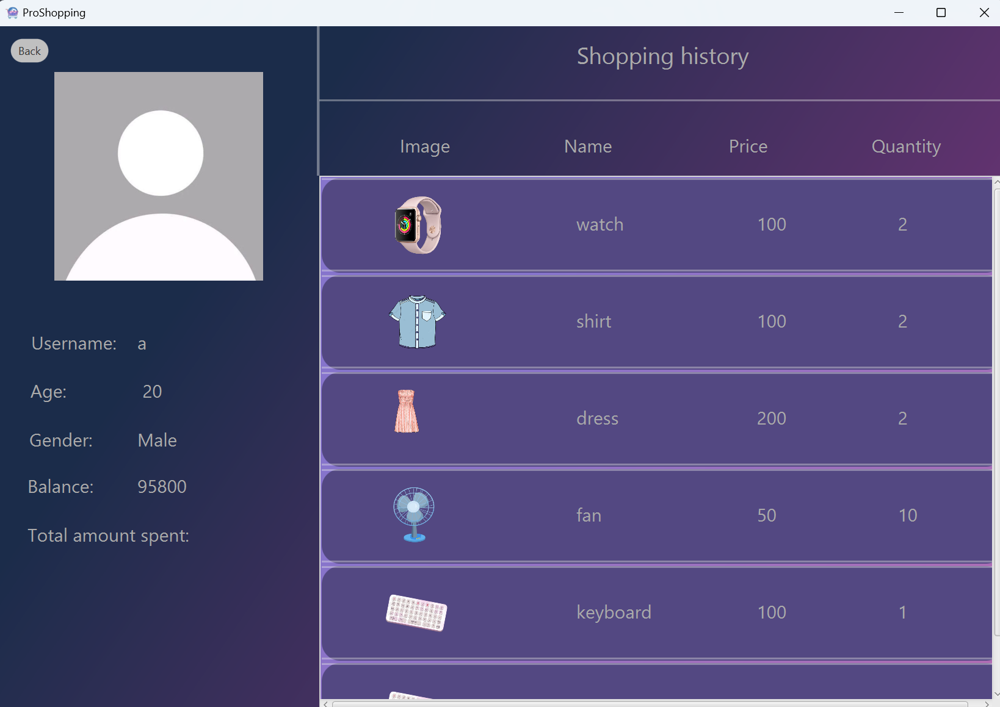

# ProShopping

###Ứng dụng mua hàng online

##### Author: [TuanNgoc](https://github.com/0sym1)   

## Demo: [Video demo](https://youtu.be/nHStiMosGO4)

### Screenshots

### Features
-	Tìm kiếm, sắp xếp, xem sản phẩm
-	Thêm sản phẩm vào giỏ hàng và mua sản phẩm
-	Xem profile và lịch sử mua hang
-	Đăng nhập, tạo tài khoản và quản lý tài khoản
-	Thêm, xóa, sửa sản phẩm (Admin)

### Requirements
- Java 21
- Source/Binary Format: JDK 21 
- Profile: Full JRE
- Encoding: UTF-8

### Installation
Cách cài đặt dự án

- Clone dự án
- Chạy class Main.java

### License
[MIT](https://choosealicense.com/licenses/mit/)
